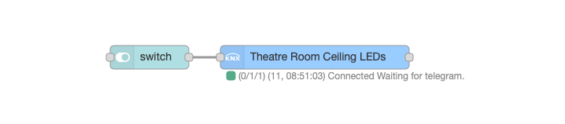

<br/>

[![NPM version][npm-version-image]][npm-url]
[![NPM downloads per month][npm-downloads-month-image]][npm-url]
[![NPM downloads total][npm-downloads-total-image]][npm-url]
[![MIT License][license-image]][license-url]
[](https://standardjs.com)
[![Facebook][facebook-image]][facebook-url]
[](https://www.paypal.me/techtoday) 




Control your KNX intallation via Node-Red! Single Node KNX IN/OUT with optional ETS group address importer and gateway simulation. Easy to use and highly configurable.

**You can use it immediately!**
```javascript
payload = true // Turn light on
payload = {red:255, green:200, blue:30} // Put some colors in our life
```

## DESCRIPTION

* **KNX-ULTIMATE node** [here](https://github.com/Supergiovane/node-red-contrib-knx-ultimate/wiki/2.-Node-Configuration), allow you to control your *KNX installation* via Node-Red. You can control all your KNX devices as well as create a *Virtual Device* in Node-Red, to link external *non KNX* devices, and make it compatible with your KNX installation. I'ts very SIMPLE TO USE thus very customizable.  
* **SCENE CONTROLLER node** [here](https://github.com/Supergiovane/node-red-contrib-knx-ultimate/wiki/SceneController-Configuration), The scene controller node can act as a real scene controller, with recall and save of the current scene.
* **WATCHDOG node** [here](https://github.com/Supergiovane/node-red-contrib-knx-ultimate/wiki/7.-WatchDog-Configuration), allows notification (Email, Twitter, Telegram, Alexa, Siri, Sonos -with sonospollytts node- and so on) of KNX Bus connection errors, automatic or manual switchover to a backup KNX/IP router if the primary fails and allows you to programmatically change the config-node directly from a msg flow.
* **LOGGER node** [here](https://github.com/Supergiovane/node-red-contrib-knx-ultimate/wiki/Logger-Configuration), creates an XML diagnostic file, compatible with ETS. You can open it with ETS for diagnostic pourposes. Node: the Logger currently doesn't record the telegrams coming from KNX-Ultimate if you use a **KNX/IP Interface**. 
* **GLOBAL CONTEXT node** [here](https://github.com/Supergiovane/node-red-contrib-knx-ultimate/wiki/SampleGlobalContextNode), exposes the group addresses to a Global Context variable, to be used in function nodes.


[ Support the project, buy an (overpriced) die-cut sticker "powered by KNX-Ultimate" for your products](https://teespring.com/it/stores/knx-ultimate-support-store)

## CHANGELOG

* See <a href="https://github.com/Supergiovane/node-red-contrib-knx-ultimate/blob/master/CHANGELOG.md">here the changelog</a>


## HELP, SAMPLES, TROUBLESHOOT, WIKI, FAQ, BEST PRACTICES

Click your language to go to the documentation.<br/>
<a href="https://github.com/Supergiovane/node-red-contrib-knx-ultimate/wiki/Overview"></a>
<a href="https://github.com/Supergiovane/node-red-contrib-knx-ultimate/wiki/de-Overview"></a>
<a href="https://github.com/Supergiovane/node-red-contrib-knx-ultimate/wiki/it-Overview"></a><br/>

> Click a language above. Tons of documentation, samples, even for use in conjunction with   


## STARTER PACK

* [Wiki and Help](https://github.com/Supergiovane/node-red-contrib-knx-ultimate/wiki)
* [Youtube video](https://www.youtube.com/playlist?list=PL9Yh1bjbLAYpfy1Auz6CKDfXUusgMwOQr)
* [Facebook page](https://www.facebook.com/supergiovaneDev)
* [FAQ + Troubleshoot](https://github.com/Supergiovane/node-red-contrib-knx-ultimate/wiki/5.-FAQ-Troubleshoot)
* [Security best practices](https://github.com/Supergiovane/node-red-contrib-knx-ultimate/wiki/SECURITY)
* [NODE-RED KNX-ULTIMATE TEST SITE](http://casacorte.myqnapcloud.com:2021) Online node-red public test website (and Dashboard UI as well http://casacorte.myqnapcloud.com:2021/ui). There is a node-red installation ready to be tested, with KNX-Ultimate fully set in "emulation" mode (you cannot do any damage, because the KNX backbone is simulated).


## Highlights

If you're here, you probably already have tried other knx nodes from npm. I hope you enjoy this one, because i've put big effort to do what i really needed, a copy/paste friendly node, with many functions and the possibility to use the ETS csv exported Group Addresses.<br />

<details><summary>Stand alone or with ETS exported file</summary>

You can set you own group address, datapoint and device name, or you can import the ETS Group Address list and have datapoint and device name auto populated while typing in the group address.

</details>
<details><summary>Filling helpers</summary>

If you import your ETS CSV or ESF file, just begin typing the group address or the device name in the Group Address textbox and a list of possible matches will appear. Just select an item in the list it and have datapoint and device name auto populated. You can then accept the auto populated fields or change it.

</details>
<details><summary>Automatic encoding/deconding of KNX datagrams</summary>

Just pass a normal payload to the node (true, false, a string or any nymber) and just receive a normal payload (true, false, a string or any nymber) to use in your flow.

</details>
<details><summary>As single device, as Universal node or as Emulation of a real KNX device</summary>

The node can act as a single device (for example having Group Address 0/0/1), or can be used as universal node, catching all messages coming from KNX Bus (in this case the node will output a comprehensive msg to the flow, containing group address, device name, automatic decoded payload and other useful infos). The node can act as universal KNX sender as well (you can pass a message to the node, containing the destination group address, the datapont type and the payload).
You can even use the node to emulate a phisically non existent KNX device. The node will behave exactly as a normal KNX Device and will also respond to read requests coming from the KNX bus, by sending the current payload value to the KNX bus.

</details>
<details><summary>Contextual help for formatting input messages</summary>

There is samples. There is huge documentation about settings and properties. If this is not enough for you, whenever you change the datapoint type, a textblock with a sample msg input (expecially, for tricky datapoints, like RGBW, 10Bytes, Relative Dimming, 3 Bytes setpoint etc...) appears. Just copy/paste it in a function and you're done.

</details>
<details><summary>Huge amount of Datapoints are supported</summary>

It supports a huge amount of datapoints. If you need more, just open a GitHub issue.

</details>
<details><summary>Self protection</summary>

The Node protects you, from mistakes you can do. [Node Protections](https://github.com/Supergiovane/node-red-contrib-knx-ultimate/wiki/-Protections)

</details>
<details><summary>Built in RBE input/output filter</summary>

You can select to activate or deactivate it. If active, the node reacts only if payload from KNX Bus or from input msg is changed.

</details>
<details><summary>Automatic KNX interface type detection</summary>

Full support for IP Interfaces as well for IP Routers. It's recommended the use of IP Routers because of simple setup and stability in a large environment.

</details>
<details><summary>RAW message directly to the BUS</summary>

You can send RAW buffers directly to the bus.

</details>
<details><summary>Gateway simulation</summary>

By putting **EMULATE** in the gateway IP field, the gateway node will not write to the KNX BUS. Useful for simulations and classsrooms.

</details>


## WORKING WITH THE ETS CSV FILE OR WITH ESF FILE

Instead of create a knx-ultimate node for each Group Address to control, you can import your ETS csv or esf group addresses file.  
Thanks to that, the knx-ultimate node where you selected **Universal mode (listen to all Group Addresses)**, becomes an universal input/output node, aware of all Datapoints, Group Addresses and Device's name (ex: Living Room Lamp). Just send the payload to the knx-ultimate node, and it'll encode it with the right datapoint and send it to the bus. Likewise, when the knx-ultimate node receives a telegram from the bus, it outputs a right decoded payload using the datapoint specified in the ETS file.

<details><summary>Sample ETS csv file to paste into the ETS field of your config node.</summary>

> Copy/Paste this into your configuration node.

```javascript
"Group name"	"Address"	"Central"	"Unfiltered"	"Description"	"DatapointType"	"Security"
"Attuatori luci"	"0/-/-"	""	""	"Attuatori luci"	""	"Auto"
"Luci primo piano"	"0/0/-"	""	""	"Luci primo piano"	""	"Auto"
"Camera da letto luce"	"0/0/1"	""	""	"Camera da letto luce"	"DPST-1-8"	"Auto"
"Loggia camera da letto"	"0/0/2"	""	""	"Loggia camera da letto"	"DPST-1-1"	"Auto"
"Camera armadi luce"	"0/0/3"	""	""	"Camera armadi luce"	"DPST-1-1"	"Auto"
"Bagno grande luce"	"0/0/4"	""	""	"Bagno grande luce"	"DPST-1-1"	"Auto"
"Loggia bagno grande"	"0/0/5"	""	""	"Loggia bagno grande"	"DPST-1-1"	"Auto"
"Bagno grande specchio (switch)"	"0/0/6"	""	""	"Bagno grande specchio switch"	"DPST-1-1"	"Auto"
"Lavanderia luce"	"0/0/7"	""	""	"Lavanderia luce"	"DPST-1-1"	"Auto"
"Lavanderia specchio (switch)"	"0/0/8"	""	""	"Lavanderia specchio switch"	"DPST-1-1"	"Auto"
"Studio luce"	"0/0/9"	""	""	"Studio luce"	"DPST-1-1"	"Auto"
"Soggiorno luce (switch)"	"0/0/10"	""	""	"Soggiorno luce switch"	"DPST-1-1"	"Auto"
"Soggiorno aplique (switch)"	"0/0/11"	""	""	"Soggiorno aplique switch"	"DPST-1-1"	"Auto"
"Loggia soggiorno cucina"	"0/0/12"	""	""	"Loggia soggiorno-cucina"	"DPST-1-1"	"Auto"
"Cucina luce"	"0/0/13"	""	""	"Cucina luce"	"DPT-1"	"Auto"
"Cucina luce pensili"	"0/0/14"	""	""	"Cucina luce pensili"	"DPT-1"	"Auto"
"Corridoio luce"	"0/0/15"	""	""	"Corridoio luce"	"DPST-1-1"	"Auto"
"Scala LED"	"0/0/16"	""	""	"Scala LED"	"DPST-1-1"	"Auto"
"Soggiorno aplique brighness value"	"0/0/17"	""	""	""	"DPST-5-1"	"Auto"
"Bagno grande specchio (dim)"	"0/0/18"	""	""	"Bagno grande specchio dim"	"DPST-3-7"	"Auto"
"Soggiorno luce brighness value"	"0/0/19"	""	""	""	"DPST-5-1"	"Auto"
"Lavanderia specchio (dim)"	"0/0/20"	""	""	"Lavanderia specchio dim"	"DPST-3-7"	"Auto"
"Scala LED cambiacolori RGB"	"0/0/21"	""	""	""	"DPST-1-1"	"Auto"
"Bagno grande specchio brightness value"	"0/0/22"	""	""	""	"DPST-5-1"	"Auto"
"Soggiorno luce (dim)"	"0/0/23"	""	""	"Soggiorno luce dim"	"DPST-3-7"	"Auto"
```

</details>


<details><summary>Sample ETS esf file to paste into the ETS field of your config node.</summary>

> Copy/Paste this into your configuration node.

```javascript
My beautiful home
Attuatori luci.Luci primo piano.0/0/1	Luce camera da letto	EIS 1 'Switching' (1 Bit)	Low	
Attuatori luci.Luci primo piano.0/0/2	Luce loggia camera da letto	EIS 1 'Switching' (1 Bit)	Low	
Attuatori luci.Luci primo piano.0/0/3	Luce camera armadi	EIS 1 'Switching' (1 Bit)	Low	
Attuatori luci.Luci primo piano.0/0/4	Luce bagno grande	EIS 1 'Switching' (1 Bit)	Low	
Attuatori luci.Luci primo piano.0/0/5	Luce loggia bagno grande	EIS 1 'Switching' (1 Bit)	Low	
Attuatori luci.Luci primo piano.0/0/6	Luce specchio bagno grande (switch)	EIS 1 'Switching' (1 Bit)	Low	
Attuatori luci.Luci primo piano.0/0/7	Luce lavanderia	EIS 1 'Switching' (1 Bit)	Low	
Attuatori luci.Luci primo piano.0/0/8	Luce specchio lavanderia (switch)	EIS 1 'Switching' (1 Bit)	Low	
Attuatori luci.Luci primo piano.0/0/9	Luce studio	EIS 1 'Switching' (1 Bit)	Low	
Attuatori luci.Luci primo piano.0/0/10	Plafoniera soggiorno (switch)	EIS 1 'Switching' (1 Bit)	Low	
Attuatori luci.Luci primo piano.0/0/11	Applique soggiorno (switch)	EIS 1 'Switching' (1 Bit)	Low	
Attuatori luci.Luci primo piano.0/0/12	Luce loggia soggiorno cucina	EIS 1 'Switching' (1 Bit)	Low	
Attuatori luci.Luci primo piano.0/0/13	Luce cucina	EIS 1 'Switching' (1 Bit)	Low	
Attuatori luci.Luci primo piano.0/0/14	Pensili cucina	EIS 1 'Switching' (1 Bit)	Low	
Attuatori luci.Luci primo piano.0/0/15	Luce corridoio	EIS 1 'Switching' (1 Bit)	Low	
Attuatori luci.Luci primo piano.0/0/16	LED scala	EIS 1 'Switching' (1 Bit)	Low	
Attuatori luci.Luci primo piano.0/0/18	Luce specchio bagno grande(dim)	EIS 2 'Dimming - control' (4 Bit)	Low	
Attuatori luci.Luci primo piano.0/0/20	Luce specchio lavanderia (dim)	EIS 2 'Dimming - control' (4 Bit)	Low	
Attuatori luci.Luci primo piano.0/0/23	Plafoniera soggiorno (dim)	EIS 2 'Dimming - control' (4 Bit)	Low	
Attuatori luci.Luci primo piano.0/0/24	Applique soggiorno (dim)	EIS 2 'Dimming - control' (4 Bit)	Low	
Attuatori luci.Luci primo piano.0/0/17	Applique soggiorno brighness value	Uncertain (1 Byte)	Low	
Attuatori luci.Luci primo piano.0/0/19	Plafoniera soggiorno brighness value	Uncertain (1 Byte)	Low	
Attuatori luci.Luci primo piano.0/0/21	LED cambiacolori RGB scala	EIS 1 'Switching' (1 Bit)	Low	
```

</details>

> You can work with a mix of knx-ultimate nodes, some with **Universal mode (listen to all Group Addresses)** checked and some not. You are absolutely free! See this youtube video,

<a href="https://youtu.be/egRbR_KwP9I" target="_blank"></a>

<br/>


# <a href="https://github.com/Supergiovane/node-red-contrib-knx-ultimate/wiki">Click here for comprehensive samples</a>
**Turn on/off a Lamp**
```javascript
return {payload:true}
```
```javascript
return {payload:false}
```

**Increase the light/open blind**
```javascript
// The parameter "data" indicates the relative amount of the dimming commmand (how much to dim).
// The parameter "data" can be any integer value from 0 to 7
// The parameter decr_incr:1 increases the light
// The parameter decr_incr:0 decreases the light
msg.payload = {decr_incr: 1, data: 5};
return msg;
```

**Set RGBW color**
```javascript
// Each color in a range between 0 and 255
msg.payload = {red:90, green:200, blue:30, white:120, mR:1, mG:1, mB:1, mW:1};
return msg;
```

--> [MORE Samples and documentation....](https://github.com/Supergiovane/node-red-contrib-knx-ultimate/wiki)

<br/>


## COMMERCIAL COMPANIES USING KNX-ULTIMATE
List of commercial companies, which have given us permission to be mentioned on this page. Want to be listed here? Email to maxsupergiovane@icloud.com

<br/>

<table> 
<tr> 
<td style="valign:center; border: 0px; padding: 15px;">


</td> 

<td style="valign:center; border: 0px; padding: 15px;">

[](https://www.tervis.it)
</td> 
<td style="valign:center; border: 0px; padding: 15px;"> 

[](http://www.knxsardegna.com)
</td> 
<td style="valign:center; border: 0px; padding: 15px;"> 

[](https://www.agatastore.it)
</td>
<td style="valign:center; border: 0px; padding: 15px;">

[](https://proknx.com)
</td> 
</tr> 
</table> 


<br/>

* [Tervis - Alarm System Manufacturer](https://www.tervis.it)
* [KNX Sardegna - Gianmarco Sitzia, Certified KNX Partner](http://www.knxsardegna.com)
* [Agata Store - Professional store and Certified KNX Partner](https://www.agatastore.it)
* [ProKNX - KNX Device Manufacturer](https://proknx.com)

<br/>

## FRIENDLY COMMUNITIES AROUND THE WORLD

**Italy**
* [VivereSmart](https://www.facebook.com/groups/viveresmart)
* [VivereSmart TV](https://www.youtube.com/channel/UC6GlFhcbNuoSEejZ_HlCynA)

**Germany**
* [knx-user-forum](https://knx-user-forum.de/forum/öffentlicher-bereich/knx-eib-forum/1389088-knx-node-for-node-red)


<br/>
<br/>


[license-image]: https://img.shields.io/badge/license-MIT-blue.svg
[license-url]: https://github.com/Supergiovane/node-red-contrib-knx-ultimate/master/LICENSE
[npm-url]: https://npmjs.org/package/node-red-contrib-knx-ultimate
[npm-version-image]: https://img.shields.io/npm/v/node-red-contrib-knx-ultimate.svg
[npm-downloads-month-image]: https://img.shields.io/npm/dm/node-red-contrib-knx-ultimate.svg
[npm-downloads-total-image]: https://img.shields.io/npm/dt/node-red-contrib-knx-ultimate.svg
[facebook-image]: https://img.shields.io/badge/Visit%20me-Facebook-blue
[facebook-url]: https://www.facebook.com/supergiovaneDev