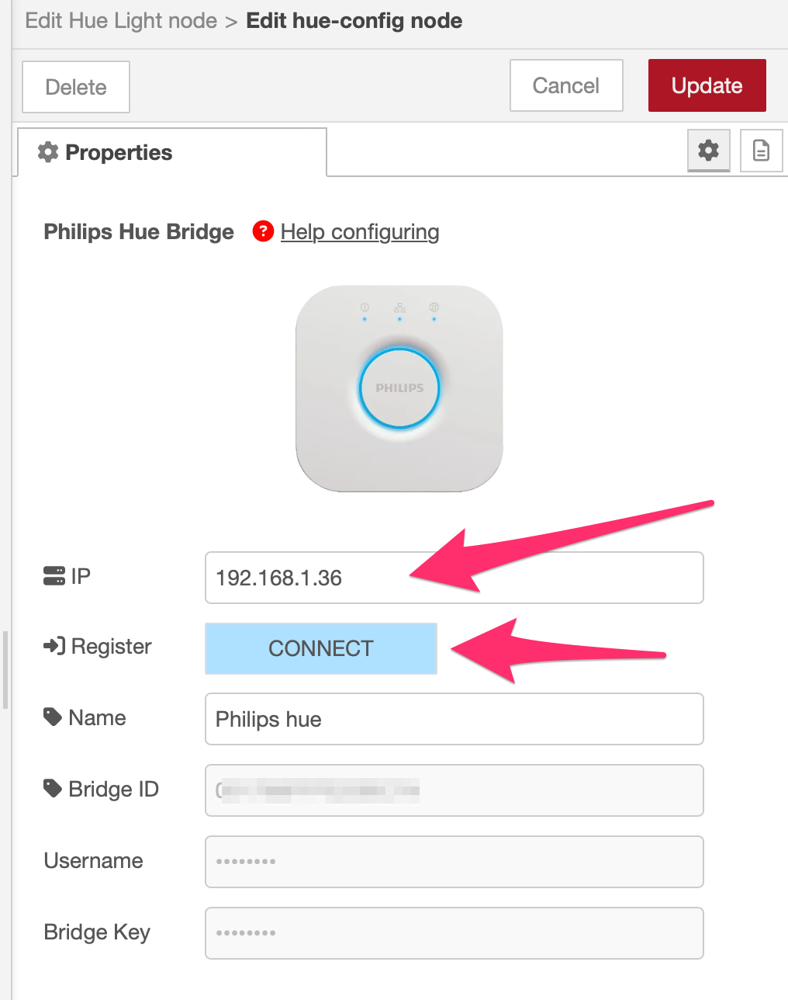

## Upgrade auf KNX Ultimate 8

Version 7 ergänzt oben in jedem Knoteneditor eine kleine Schaltfläche **Auf v8 aktualisieren**. Sie sichert die Flows, installiert die benötigten HUE-/Matter-Pakete, konvertiert kompatible Knoten, führt ein vollständiges Deploy aus, prüft die gespeicherten Flows und installiert Version 8. Starten Sie den Node-RED-Dienst anschließend wie aufgefordert neu; nur den Browser neu zu laden genügt nicht. Bisherige KNX-AI-Knoten stoppen den automatischen Vorgang.

[Vollständige Upgrade-Anleitung lesen](https://supergiovane.github.io/node-red-contrib-knx-ultimate/wiki/de-Upgrade-to-v8)

<h1>PHILIPS HUE NODES

</h1>

  

Dieser Node registriert Node-RED an der Hue Bridge und führt den Kopplungsvorgang jetzt automatisch aus.

Gib die IP des Bridge ein (oder wähle eine automatisch erkannte Bridge) und klicke auf **CONNECT**. Der Editor fragt die Bridge weiter an und schließt den Warte-Dialog automatisch, sobald du die physische Link-Taste gedrückt hast. Mit **CANCEL** kannst du den Vorgang jederzeit stoppen und später erneut versuchen. Die Felder für Benutzername und Client Key bleiben bearbeitbar, damit du die Zugangsdaten jederzeit kopieren oder manuell einfügen kannst.

Du hast die Zugangsdaten bereits? Klicke auf **ICH HABE BEREITS DIE ZUGANGSDATEN**, um die Felder sofort einzublenden und sie manuell einzugeben, ohne auf den Bridge-Button zu warten.

**Allgemein**

| Eigenschaft | Beschreibung |
|--|--|
| IP | Gib die feste IP deiner Hue Bridge ein oder wähle einen automatisch gefundenen Eintrag aus der Liste. |
| VERBINDEN | Startet die Registrierung und wartet auf den Tastendruck an der Bridge. Der Dialog schließt sich automatisch nach dem Tastendruck; mit **CANCEL** kannst du das Warten beenden. |
| Name | Name der Bridge, der nach erfolgreicher Verbindung von der Hue Bridge gelesen wird. |
| Benutzername | Von der Hue Bridge nach der Kopplung zurückgegebener Benutzername. Das Feld bleibt editierbar für Copy & Paste oder manuelle Eingaben. |
| Client-Schlüssel | Von der Hue Bridge nach der Kopplung zurückgegebener Client-Schlüssel. Das Feld bleibt editierbar für Copy & Paste oder manuelle Eingaben. |

