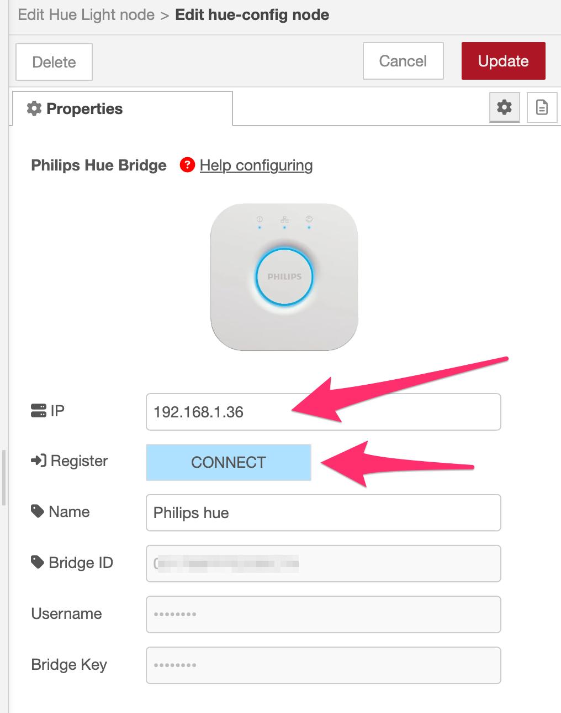

🌐 Language: [EN](/node-red-contrib-knx-ultimate/wiki/HUE+Bridge+configuration) | [IT](/node-red-contrib-knx-ultimate/wiki/it-HUE+Bridge+configuration) | [DE](/node-red-contrib-knx-ultimate/wiki/de-HUE+Bridge+configuration) | [FR](/node-red-contrib-knx-ultimate/wiki/fr-HUE+Bridge+configuration) | [ES](/node-red-contrib-knx-ultimate/wiki/es-HUE+Bridge+configuration) | [简体中文](/node-red-contrib-knx-ultimate/wiki/zh-CN-HUE+Bridge+configuration)
<!-- NAV START -->
Navigazione: [Home](https://supergiovane.github.io/node-red-contrib-knx-ultimate/wiki/it-Home)  
Panoramica: [Changelog](https://github.com/Supergiovane/node-red-contrib-knx-ultimate/blob/master/CHANGELOG.md) • [FAQ](https://supergiovane.github.io/node-red-contrib-knx-ultimate/wiki/it-FAQ-Troubleshoot) • [Sicurezza](https://supergiovane.github.io/node-red-contrib-knx-ultimate/wiki/it-SECURITY) • [Docs: Barra lingue](https://supergiovane.github.io/node-red-contrib-knx-ultimate/wiki/it-Docs-Language-Bar)  
Nodo KNX Dispositivo: [Gateway](https://supergiovane.github.io/node-red-contrib-knx-ultimate/wiki/it-Gateway-configuration) • [Dispositivo](https://supergiovane.github.io/node-red-contrib-knx-ultimate/wiki/it-Device) • [Protezioni](https://supergiovane.github.io/node-red-contrib-knx-ultimate/wiki/it-Protections)  
Altri Nodi KNX: [Scene Controller](https://supergiovane.github.io/node-red-contrib-knx-ultimate/wiki/it-SceneController-Configuration) • [WatchDog](https://supergiovane.github.io/node-red-contrib-knx-ultimate/wiki/it-WatchDog-Configuration) • [Logger](https://supergiovane.github.io/node-red-contrib-knx-ultimate/wiki/it-Logger-Configuration) • [Global Context](https://supergiovane.github.io/node-red-contrib-knx-ultimate/wiki/it-GlobalVariable) • [Alerter](https://supergiovane.github.io/node-red-contrib-knx-ultimate/wiki/it-Alerter-Configuration) • [Controllo Carico](https://supergiovane.github.io/node-red-contrib-knx-ultimate/wiki/it-LoadControl-Configuration) • [Viewer](https://supergiovane.github.io/node-red-contrib-knx-ultimate/wiki/it-knxUltimateViewer) • [Auto Responder](https://supergiovane.github.io/node-red-contrib-knx-ultimate/wiki/it-KNXAutoResponder) • [Traduttore HA](https://supergiovane.github.io/node-red-contrib-knx-ultimate/wiki/it-HATranslator) • [IoT Bridge](https://supergiovane.github.io/node-red-contrib-knx-ultimate/wiki/it-IoT-Bridge-Configuration)  
HUE: [Bridge](https://supergiovane.github.io/node-red-contrib-knx-ultimate/wiki/it-HUE+Bridge+configuration) • [Luce](https://supergiovane.github.io/node-red-contrib-knx-ultimate/wiki/it-HUE+Light) • [Batteria](https://supergiovane.github.io/node-red-contrib-knx-ultimate/wiki/it-HUE+Battery) • [Pulsante](https://supergiovane.github.io/node-red-contrib-knx-ultimate/wiki/it-HUE+Button) • [Contatto](https://supergiovane.github.io/node-red-contrib-knx-ultimate/wiki/it-HUE+Contact+sensor) • [Aggiornamento SW](https://supergiovane.github.io/node-red-contrib-knx-ultimate/wiki/it-HUE+Device+software+update) • [Sensore Luce](https://supergiovane.github.io/node-red-contrib-knx-ultimate/wiki/it-HUE+Light+sensor) • [Movimento](https://supergiovane.github.io/node-red-contrib-knx-ultimate/wiki/it-HUE+Motion) • [Scena](https://supergiovane.github.io/node-red-contrib-knx-ultimate/wiki/it-HUE+Scene) • [Tap Dial](https://supergiovane.github.io/node-red-contrib-knx-ultimate/wiki/it-HUE+Tapdial) • [Temperatura](https://supergiovane.github.io/node-red-contrib-knx-ultimate/wiki/it-HUE+Temperature+sensor) • [Connettività Zigbee](https://supergiovane.github.io/node-red-contrib-knx-ultimate/wiki/it-HUE+Zigbee+connectivity)  
Esempi: [Logger](https://supergiovane.github.io/node-red-contrib-knx-ultimate/wiki/it-Logger-Sample) • [Switch Light](https://supergiovane.github.io/node-red-contrib-knx-ultimate/wiki/-Sample---Switch-light) • [Dimming](https://supergiovane.github.io/node-red-contrib-knx-ultimate/wiki/-Sample---Dimming) • [RGB color](https://supergiovane.github.io/node-red-contrib-knx-ultimate/wiki/-Sample---RGB-Color) • [RGBW color + White](https://supergiovane.github.io/node-red-contrib-knx-ultimate/wiki/-Sample---RGBW-Color-plus-White) • [Command a scene actuator](https://supergiovane.github.io/node-red-contrib-knx-ultimate/wiki/-Sample---Control-a-scene-actuator) • [Datapoint 213.x 4x Setpoint](https://supergiovane.github.io/node-red-contrib-knx-ultimate/wiki/-Sample---DPT213) • [Datapoint 222.x 3x Setpoint](https://supergiovane.github.io/node-red-contrib-knx-ultimate/wiki/-Sample---DPT222) • [Datapoint 237.x DALI diags](https://supergiovane.github.io/node-red-contrib-knx-ultimate/wiki/-Sample---DPT237) • [Datapoint 2.x 1 bit proprity](https://supergiovane.github.io/node-red-contrib-knx-ultimate/wiki/-Sample---DPT2) • [Datapoint 22.x RCHH Status](https://supergiovane.github.io/node-red-contrib-knx-ultimate/wiki/-Sample---DPT22) • [Datetime to BUS](https://supergiovane.github.io/node-red-contrib-knx-ultimate/wiki/-Sample---DateTime-to-BUS) • [Read Status](https://supergiovane.github.io/node-red-contrib-knx-ultimate/wiki/-Sample---Read-value-from-Device) • [Virtual Device](https://supergiovane.github.io/node-red-contrib-knx-ultimate/wiki/-Sample---Virtual-Device) • [Subtype decoded](https://supergiovane.github.io/node-red-contrib-knx-ultimate/wiki/-Sample---Subtype) • [Alexa](https://supergiovane.github.io/node-red-contrib-knx-ultimate/wiki/-Sample---Alexa) • [Apple Homekit](https://supergiovane.github.io/node-red-contrib-knx-ultimate/wiki/-Sample---Apple-Homekit) • [Google Home](https://supergiovane.github.io/node-red-contrib-knx-ultimate/wiki/-Sample---Google-Assistant) • [Switch on/off POE port of Unifi switch](https://supergiovane.github.io/node-red-contrib-knx-ultimate/wiki/-Sample---UnifiPOE) • [Set configuration by msg](https://supergiovane.github.io/node-red-contrib-knx-ultimate/wiki/-Sample-setConfig) • [Scene Controller node](https://supergiovane.github.io/node-red-contrib-knx-ultimate/wiki/Sample-Scene-Node) • [WatchDog node](https://supergiovane.github.io/node-red-contrib-knx-ultimate/wiki/-Sample---WatchDog) • [Global Context node](https://supergiovane.github.io/node-red-contrib-knx-ultimate/wiki/SampleGlobalContextNode) • [Alerter node](https://supergiovane.github.io/node-red-contrib-knx-ultimate/wiki/SampleAlerter) • [Load control node](https://supergiovane.github.io/node-red-contrib-knx-ultimate/wiki/SampleLoadControl) • [Viewer node](https://supergiovane.github.io/node-red-contrib-knx-ultimate/wiki/knxUltimateViewer) • [MySQL, InfluxDB, MQTT Sample](https://supergiovane.github.io/node-red-contrib-knx-ultimate/wiki/Sample-KNX2MQTT-KNX2MySQL-KNX2InfluxDB)
<!-- NAV END -->
---
<h1>
PHILIPS HUE NODES
</h1>
 

  

Questo nodo registra Node-RED presso l'Hue Bridge e ora gestisce automaticamente la procedura di abbinamento.
Inserisci l'IP del bridge (o scegli uno tra quelli individuati automaticamente) e premi **CONNECT**. L'editor continua a interrogare il bridge e chiude la finestra di attesa non appena premi il pulsante fisico di collegamento. Usa **CANCEL** se vuoi interrompere l'attesa e riprovare più tardi. I campi Username e Client Key restano sempre modificabili in modo da poter copiare o incollare le credenziali quando serve.
Hai già le credenziali? Fai clic su **HO GIÀ LE CREDENZIALI** per mostrare subito i campi e inserirle manualmente senza attendere il pulsante del bridge.
**Generale**
| Proprietà | Descrizione |
|--|--|
| IP | Inserisci l'IP fisso del tuo bridge Hue oppure seleziona uno tra quelli scoperti automaticamente. |
| CONNECT | Avvia la registrazione e attende il pulsante di collegamento del bridge. La finestra si chiude automaticamente quando premi il pulsante; usa **CANCEL** per interrompere l'attesa. |
| Name | Nome del bridge letto dalla Hue Bridge dopo una connessione riuscita. |
| Username / Client Key | Credenziali restituite dalla Hue Bridge dopo l'abbinamento. Restano modificabili per consentire copia/incolla o l'inserimento manuale. |

